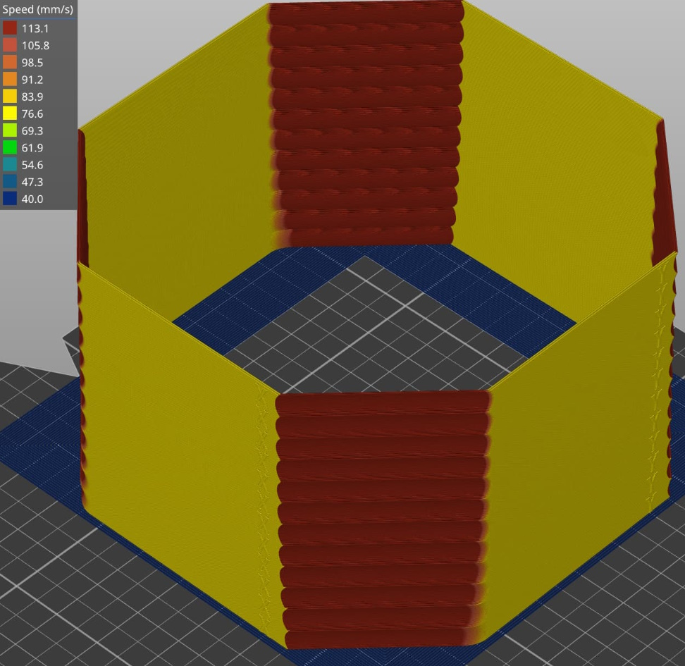
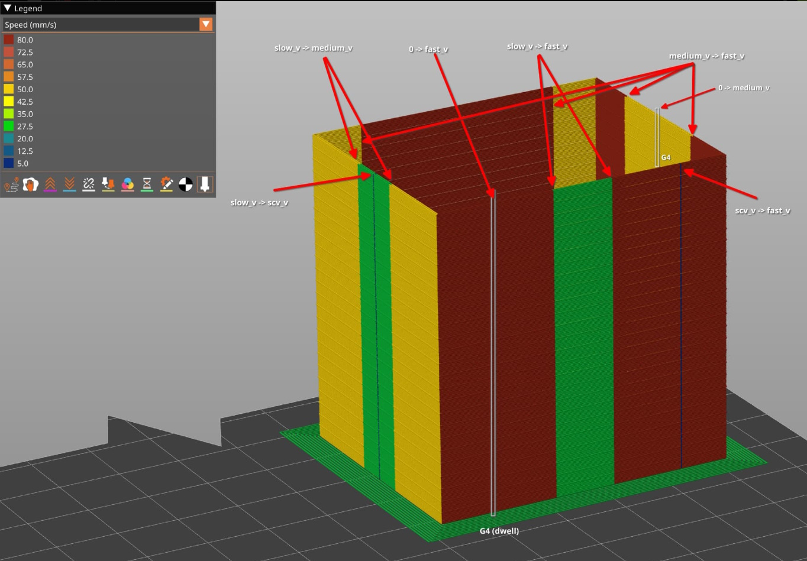

# Bleeding Edge Features Documentation

The following are experimental features found in the bleeding edge branch of danger klipper and should be used at your own caution. The support for these features is limited and your experience may vary! If you do use the features and find them useful, discover bugs, or have improvements please use the klipper discourse forums or discord to discuss your findings.
https://github.com/dmbutyugin/klipper/commits/advanced-features

Refer to the [Bleeding Edge Configuration Reference](Config_Reference_Bleeding_Edge.md) for details on printer configurations for these features.

## High precision stepping and new stepcompress protocol

Reference Discussion of this feature: https://klipper.discourse.group/t/improved-stepcompress-implementation/3203

### Overview

The new stepcompress protocol and precision stepping feature is a proposed improvement in the control and accuracy of stepper motor movements. This feature enhances the step compression algorithm, crucial for transmitting stepper commands accurately.

### Existing Step Compression Mechanism

- **Process**: Initially, an iterative solver generates step timings based on movement and kinematics. These steps are then compressed for transmission, and the MCU executes the compressed steps.
- **Standard Compression:** The format used for compression is step[i] = step[0] + interval _ i + add _ i \* (i-1) / 2. Only interval, add, and count are transmitted, making this a lossy compression with each step falling within a specific range relative to the true step.

### Limitations of Current Method

- **Systematic Artifacts:** The existing method introduces systematic artifacts in acceleration profiles, particularly at junctions of different velocities.
- **Approximation Limitation:** The current compression effectively uses only the first term of the Taylor series expansion, leading to inaccuracies in step timings.

### Improved Step Compression Schema

- **New Format:** The improved formula is step[i] = step[0] + (interval _ i + add _ i _ (i-1) / 2 + add2 _ i _ (i-1) _ (i-2) / 6) >> shift. This adds a second term to the Taylor expansion and employs fixed-point arithmetic for higher precision.
- **Implementation:** Implemented with a consideration for rounding and remainders, leading to a more precise match with the actual step timings.

### Advantages of New Method

- **Reduced Error Margin:** The new method reduces the error margin to approximately +/- 1.5% from the true step.
- **Smooth Acceleration Profiles:** Ensures smoother acceleration profiles, potentially making for more effective input shaping and reducing vibration artifacts.

### Computational Considerations

- **Increased Computational Demand:** The new protocol is more computationally intensive and increases the data volume transmitted to the MCU.
- **Performance Impact:** While performance at high speeds is maintained in most cases, there may be a slight reduction in maximum achievable speeds, especially on less powerful MCUs. This reduction is roughly estimated to be 20-40% less than the current stepcompress algorithm.
- **Reccomended Hardware:** RPIv4 or similar hardware that is capable of processing 1M+ steps/sec using the current stepcompress algorithm.

### Real-World Testing and Results

- **Benchmarks and Tests:** Various tests, including printing complex shapes at high speeds, were conducted to assess the practical impact of the new step compression method.
- **Performance on Different Hardware:** The performance impact varies based on the MCU, with minimal impact on 32-bit MCUs and more significant impact on 8-bit MCUs.
- **Motor EMF Considerations:** This method is likely not to provide much advantage for motors which are being operated at their top speed for a given power supply voltage. It has been demonstrated by Eddietheengineer {https://www.youtube.com/watch?v=4Z2FBA_cBoE&t=1s} that stepper current becomes distorted as the motor back EMF approaches PSU voltage. Accurate stepping becomes less of a concern as the stepper motor driver can no longer push current into the motor accurately.

## Smooth Input Shapers

Reference Discussion of this feature: https://klipper.discourse.group/t/scurve-pa-branch/7621/3

### Overview

The Smooth Input Shaper feature employs polynomial smooth functions designed to cancel vibrations at certain frequencies, similar to regular input shapers. The feature aims to provide shapers that have somewhat better overall characteristics.

### Key Features

- **Polynomial smooth functions:** Unlike traditional discrete input shapers, Smooth Input Shaper uses polynomial smooth functions for more effective smoothing of the toolhead motion.
- **Similar to s-curve acceleration:** Offers an acceleration profile that is akin to S-curve acceleration, but with fixed timing instead of spanning the entire acceleration/deceleration phase and profile shape specifically designed to cancel the vibrations at certain frequencies.

- **Extruder Benefits**: Better performance of the extruder with pressure advance. Synchronization of the extruder with input shaping.

- **Improved effectiveness:** Generally more effective than corresponding discrete input shapers, providing slightly more smoothing.

### Smooth shapers avaliable

- **smooth_zv** - Smooth version of zv input shaper
- **smooth_mzv** - Smooth version of mzv input shaper
- **smooth_ei** - Smooth version of ei input shaper
- **smooth_2hump_ei** - Smooth version of 2hump_ei input shaper
- **smooth_zvd_ei** - Zero Vibration Derivative - Extra-Insensitive Smooth Shaper _(Documentation and use cases currently limited)_
- **smooth_si** - Super Insensitive Smooth Shaper _(Documentation and use cases currently limited)_

### Custom smooth shapers

- Custom smooth shapers can be defined and used. _(Documentation and use cases currently limited)_

### Hardware Requirements

- **Computational intensity:** This feature is computationally more demanding. Users should consider the capabilities of their hardware and system when implementing this feature.

- **Minimum hardware:** Raspberry Pi 3 is the minimum required hardware. It runs effectively on Ender 3 up to speeds of approximately 250 mm/sec with 127 microsteps on a Raspberry Pi 3B+.

- **Ideal hardware:** Raspberry Pi 4 or Orange Pi 4 are recommended for optimal performance.

### Configuration and Usage

- **Configuration:** Configuration is similar to regular input shapers, but with some differences in parameters.
- **smoother*freq*? Parameter:** This parameter doesn't correspond exactly to the current mainline Klipper input shaper settings. It represents the minimum frequency that the smoother cancels or, more precisely, the smallest frequency of the pole it cancels. This distinction is particularly relevant for smooth_ei and smooth_2hump_ei shapers.

- **Calibration support:** The scripts/calibrate_shapers.py supports the calibration and overview of available smoothers automatically with no additional user input required.

## Extruder PA Synchronization with Input Shaping

Reference Discussion of this feature: https://klipper.discourse.group/t/extruder-pa-synchronization-with-input-shaping/3843

### Overview

The Extruder PA Synchronization with Input Shaping feature synchronizes filament extrusion (Pressure Advance - PA) with the toolhead's motion. This synchronization aims to reduce artifacts by compensating for changes in toolhead motion, especially in scenarios where input shaping is employed to minimize vibration and ringing.

### Background

Input shaping is a technique used to alter toolhead motion to reduce vibrations. While Klipper's existing pressure advance algorithm helps in synchronizing filament extrusion with toolhead motion, it is not fully aligned with the input shaping alterations. This misalignment can be particularly noticeable in scenarios where X and Y axes have different resonance frequencies, or the PA smooth time significantly deviates from the input shaper duration.

### Implementation

The feature involves:

1. Calculating toolhead motion across X, Y, and Z axes.
2. Applying input shaping to the X and Y axes.
3. Using linearization to project this motion onto the E (extruder) axis.

If the input shaper is consistent for both X and Y axes, the synchronization is precise for XY motion. In other cases, the feature provides a linear approximation over X/Y deviations, which is an improvement over the previous state.

### Observations and Improvements

- **Extrusion Moves:** The implementation shows less erratic behavior in PA during extrusion moves, with fewer retractions and deretractions.
- **Stable Extruder Velocity:** The extruder velocity becomes more stable, reflecting the steadier toolhead velocity due to input shaping.
- **Wiping Behavior:** Improved wiping behavior with more consistent retraction velocity.

### Hardware Requirements

- **Computational intensity:** This feature is computationally more demanding. Users should consider the capabilities of their hardware and system when implementing this feature and monitor for any issues.

### Testing and Results

The feature has been tested over several months, showing modest improvements in the quality of real prints. It is particularly effective for direct drive extruders with short filament paths. The impact on bowden extruders is expected to be neutral.

### Usage Recommendations

- **Retuning PA:** It is advisable to retune the pressure advance settings when using this branch. Specifically, reducing the pressure_advance_smooth_time from the default 0.04 to around 0.02 or 0.01 is recommended for direct drive extruders using non-flex filaments.
- **Areas to Monitor:** Pay attention to areas where toolhead velocity changes, such as corners, bridges, and infill connections to perimeters, for quality improvements or degradations.

## Ringing tower test print

Reference Discussion of this feature: https://klipper.discourse.group/t/alternative-ringing-tower-print-for-input-shaping-calibration/4517

### Overview

The new test methodology for input shaper calibration addresses a critical limitation of the existing ringing_tower test. This improvement is centered around isolating the vibrations on each axis during the calibration process, thereby providing more accurate and reliable results.



### Limitation of Current Ringing Tower Test

- **Simultaneous Axis Movement:** The current ringing_tower test alters the velocity of both axes due to unavoidable diagonal moves, leading to potential interference in vibration measurements.
- **Parasitic Waves:** The test can produce parasitic waves, making it challenging to measure resonance frequencies accurately, especially when one axis vibrates more than the other.

### New Test Methodology Concept

- **Isolated Axis Vibration:** The new test is designed to excite vibrations on only one axis at a time, thus overcoming the interference issue.
- **GCode Generation Requirement:** Direct GCode generation is necessary for this test, focusing on controlled acceleration and deceleration of the axes.
- **Initial Acceleration:** Both axes are accelerated during a diagonal move.
  Deceleration of Tested Axis: Only the axis being tested is decelerated to a complete stop, while the other maintains its original speed.
- **Embossed Axis Letters:** The test includes embossed letters on the sides, indicating where measurements should be taken. These letters also serve as indicators of the smoothing magnitude post-calibration.

### Advantages

- **Reliable Calibration:** Allows for more reliable input shaper calibration by measuring wave distances and numbers in specific test areas.
- **Versatility:** Though primarily tested on Ender 3 Pro, the method is adaptable to different printer types like CoreXY or Delta.

### Considerations

- **Comparison with Accelerometer Data:** The results may not fully correspond with accelerometer data due to multiple resonances on each axis, but they are still effective, especially with EI input shapers.
- **Confirmation of Accelerometer Calibration:** This test serves as a valuable tool for confirming accelerometer-based calibration results.
- **User-Specific Configuration:** Users are encouraged to add their specific configurations (e.g., heating, homing, bed meshing) to the start GCode sequences.

### Sample run command:

Note, it is not reccomended to run the command directly without the helper macros configured.

_RUN_RINGING_TEST NOZZLE=0.4 TARGET_TEMP=210 BED_TEMP=55._

### Sample helper macros

This sample Gcode can be included in **printer.cfg** or s seperate **\*.cfg** file and #included in **printer.cfg**. Specific start/end printing Gcode for the printer should be added to ensure it aligned with the standard printing process such as the appropriate heating, homing and bed meshing sequences and additional functions such as enabling fan, additional purge lines, pressure advance setup, or adjusting the flow rate.

```
[ringing_test]

[delayed_gcode start_ringing_test]

gcode:
    
    # Add your start GCode here, for example:
    # G28
    # M190 S{vars.bed_temp}
    # M109 S{vars.hotend_temp}
    # M106 S255
    
    
    M221 S{flow_percent}
    
    
    
    PRINT_RINGING_TOWER {vars.rawparams} LAYER_HEIGHT={layer_height} FIRST_LAYER_HEIGHT={first_layer_height} FINAL_GCODE_ID=end_ringing_test

[delayed_gcode end_ringing_test]
gcode:
    # Add your end GCode here, for example:
    # M104 S0 ; turn off temperature
    # M140 S0 ; turn off heatbed
    # M107 ; turn off fan
    # G91 ; relative positioning
    # G1 Z5 ; raise Z
    # G90 ; absolute positioning
    # G1 X0 Y200 ; present print
    # M84 ; disable steppers
    RESTORE_GCODE_STATE NAME=RINGING_TEST_STATE

[gcode_macro RUN_RINGING_TEST]
variable_bed_temp: -1
variable_hotend_temp: -1
variable_nozzle: -1
variable_flow_rate: -1
variable_rawparams: ''
gcode:
    # Fail early if the required parameters are not provided
    
    {action_raise_error('NOZZLE= parameter must be provided')}
    
    
    {action_raise_error('TARGET_TEMP= parameter must be provided')}
    
    SET_GCODE_VARIABLE MACRO=RUN_RINGING_TEST VARIABLE=bed_temp VALUE={params.BED_TEMP|default(60)}
    SET_GCODE_VARIABLE MACRO=RUN_RINGING_TEST VARIABLE=hotend_temp VALUE={params.TARGET_TEMP}
    SET_GCODE_VARIABLE MACRO=RUN_RINGING_TEST VARIABLE=nozzle VALUE={params.NOZZLE}
    SET_GCODE_VARIABLE MACRO=RUN_RINGING_TEST VARIABLE=flow_rate VALUE={params.FLOW_RATE|default(-1)}
    SET_GCODE_VARIABLE MACRO=RUN_RINGING_TEST VARIABLE=rawparams VALUE="'{rawparams}'"
    SAVE_GCODE_STATE NAME=RINGING_TEST_STATE
    UPDATE_DELAYED_GCODE ID=start_ringing_test DURATION=0.01
```

## PA tower test print

Reference Discussion of this feature: https://klipper.discourse.group/t/extruder-pa-synchronization-with-input-shaping/3843/27

### Overview

The features introduces a new module for printing a Pressure Advance (PA) calibration tower directly from the firmware. This module simplifies the process of calibrating the PA settings, enhancing the precision and ease of tuning for optimal print quality.



### Key Features

- **Integrated PA Test Print:** Allows users to print a PA calibration tower directly from Klipper, bypassing the need for external GCode generation.
- **Configurable Parameters:** Default parameters are set, but users can override these or add specifics such as NOZZLE size and TARGET_TEMP.
- **Velocity Transitions:** Creates several velocity transitions across the test pattern to potentiall determine different optimal PA based on these transitions.

### Configuration

- **Basic Setup:** Simply adding [pa_test] in the printer configuration may suffice for standard setups.
- **Customization Options:** Users can override parameters in the printer.cfg file or specify them in the PRINT_PA_TOWER command, such as BRIM_WIDTH, NOZZLE, and TARGET_TEMP.
- **Critical Parameters:** NOZZLE size and TARGET_TEMP are essential for accurate PA testing and must be specified each time.
- **Manual Positioning for Exotic Kinematics:** For printers with non-standard kinematics (like polar or delta), manual specification of the tower's position and size may be necessary.

### Operation

- **Command to Initiate Print:** Use PRINT_PA_TOWER command to start printing the PA tower.
- **Pre-Heating Requirement:** The extruder must be pre-heated separately as PRINT_PA_TOWER does not heat the extruder. TARGET_TEMP is used for sanity checking the configured extruder temperature.
- **Integration with Virtual SDCard:** Modified virtual_sdcard module supports printing from sources other than the virtual SD card, allowing progress tracking and standard print control commands like PAUSE, RESUME, and CANCEL_PRINT.

### Advantages Over Other Methods

- **Smooth Transition of PA Values:** Unlike the Marlin test, which can be sensitive to first layer calibration and has limited PA value testing, the Klipper PA tower allows for a smooth transition of PA values from layer to layer.
- **Direct Examination Of PA:** This method directly checks velocity transitions where PA should be applied and does not mix PA with other effects, such as smoothing of corners due to input shaping. A user is not expected to and should not look at corners of the model when choosing an appropriate PA value.
- **User-Friendly Calibration:** This method provides a more user-friendly and less fiddly approach to fine-tuning the PA value.
- **Range of Velocity Tests:** Optimal PA likely varies on the acceleration and velocity. Ideal PA values are likely to be specific to these different velocity transitions.

### Sample run command:

Note, it is not reccomended to run the command directly without the helper macros configured.

_RUN_PA_TEST NOZZLE=0.4 TARGET_TEMP=205 BED_TEMP=55_

### Sample helper macros

This sample Gcode can be included in **printer.cfg** or s seperate **\*.cfg** file and #included in **printer.cfg**. Specific start/end printing Gcode for the printer should be added to ensure it aligned with the standard printing process such as the appropriate heating, homing and bed meshing sequences and additional functions such as enabling fan, additional purge lines, pressure advance setup, or adjusting the flow rate.

```
[delayed_gcode start_pa_test]
gcode:
    
    # Add your start GCode here, for example:
    # G28
    # M190 S{vars.bed_temp}
    # M109 S{vars.hotend_temp}
    
    
    M221 S{flow_percent}
    
    TUNING_TOWER COMMAND=SET_PRESSURE_ADVANCE PARAMETER=ADVANCE START=0 FACTOR=.005
    ; PRINT_PA_TOWER must be the last command in the start_pa_test script:
    ; it starts a print and then immediately returns without waiting for the print to finish
    PRINT_PA_TOWER {vars.rawparams} FINAL_GCODE_ID=end_pa_test

[delayed_gcode end_pa_test]
gcode:
    # Add your end GCode here, for example:
    # M104 S0 ; turn off temperature
    # M140 S0 ; turn off heatbed
    # M107 ; turn off fan
    # G91 ; relative positioning
    # G1 Z5 ; raise Z
    # G90 ; absolute positioning
    # G1 X0 Y200 ; present print
    # M84 ; disable steppers
    RESTORE_GCODE_STATE NAME=PA_TEST_STATE

[gcode_macro RUN_PA_TEST]
variable_bed_temp: -1
variable_hotend_temp: -1
variable_flow_rate: -1
variable_rawparams: ''
gcode:
    # Fail early if the required parameters are not provided
    
    {action_raise_error('NOZZLE= parameter must be provided')}
    
    
    {action_raise_error('TARGET_TEMP= parameter must be provided')}
    
    SET_GCODE_VARIABLE MACRO=RUN_PA_TEST VARIABLE=bed_temp VALUE={params.BED_TEMP|default(60)}
    SET_GCODE_VARIABLE MACRO=RUN_PA_TEST VARIABLE=hotend_temp VALUE={params.TARGET_TEMP}
    SET_GCODE_VARIABLE MACRO=RUN_PA_TEST VARIABLE=flow_rate VALUE={params.FLOW_RATE|default(-1)}
    SET_GCODE_VARIABLE MACRO=RUN_PA_TEST VARIABLE=rawparams VALUE="'{rawparams}'"
    SAVE_GCODE_STATE NAME=PA_TEST_STATE
    UPDATE_DELAYED_GCODE ID=start_pa_test DURATION=0.01
```
